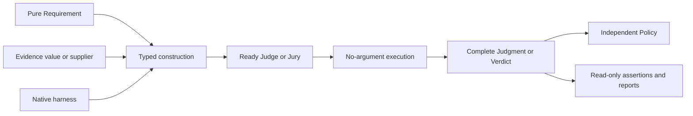

# Agent Eval

Configure typed requirements and evidence, execute a ready Judge or Jury, and retain the complete result. Java 21; source line **0.18.0-SNAPSHOT**.

A familiar assertion such as `org.assertj.core.api.Assertions.assertThat("4").isEqualTo("4")` compares exact values. A semantic assertion evaluates an actual requirement over selected evidence and retains the support and execution facts.

A deterministic check needs no invented Requirement:

```java
import io.github.markpollack.judge.Judge;
import io.github.markpollack.judge.NonEmptyJudge;
import static io.github.markpollack.judge.assertj.Assertions.assertThat;

Judge nonempty = NonEmptyJudge.builder().evidence("ready").build();
assertThat(nonempty).isPassed();
```

Construction is inert. `Judge.judge()` returns a Judgment; `Jury.vote()` returns a complete Verdict. Execution has no replacement-input overload. Only construction contracts carry specification/evidence type parameters. An evidence supplier acquires a fresh snapshot once per execution; a supplied immutable value is reused.

## Configure an actual native requirement

RFC2119 and EARS have pure native Requirement values. Their public Judges accept a generated-answer harness or a typed `NativeRuntime<RequirementRequest<S,E>,Judgment>`:

```java
import io.github.markpollack.judge.ai.requirements.Rfc2119Requirement;
import io.github.markpollack.judge.ai.requirements.Rfc2119Judge;

var integrity = Rfc2119Requirement.of("integrity", "1", "MUST",
    "preserve all original judgments", "auditability", null);
// judgeModel is a JudgeModel configured by the application.
var nativeRecipe = Rfc2119Judge.builder().runtime(judgeModel);
Judge integrityJudge = nativeRecipe.requirement(integrity)
    .evidence("Recorded execution evidence").build();
assertThat(integrity).judgedBy(nativeRecipe)
    .withEvidence("Recorded execution evidence").isSatisfied();
```

The native protocol renders the actual identity, revision, source and specification. Its Judgment retains that actual Requirement, the original answer and available native invocation observations before classification. Requirements carry no evaluators, policies or execution configuration. Rule-only Judgments remain honestly unassociated.

A reusable general model recipe works the same way:

```java
import java.util.Map;
import io.github.markpollack.judge.requirement.Requirement;
import io.github.markpollack.judge.ai.ModelBackedJudge;
import io.github.markpollack.judge.ai.JudgmentClassifiers;
import io.github.markpollack.judge.ai.prompt.JudgePromptTemplate;

var meaningRecipe = ModelBackedJudge.<String>builder().name("meaning")
    .promptTemplate(JudgePromptTemplate.fromString("meaning", """
        Requirement: {{requirement}}
        Response: {{response}}
        Reply satisfied, violated, or unknown.
        """))
    .variables(text -> Map.of("response", text))
    .runtime(judgeModel)
    .judgmentClassifier(JudgmentClassifiers.passFail("satisfied", "violated"));
var arithmetic = Requirement.text("arithmetic", "1", "The response communicates that 2 + 2 equals 4.");
Judge meaning = meaningRecipe.requirement(arithmetic)
    .evidence("Two pairs make a group of four.").build();
```

Requirement variables belong to the recipe; caller projections cannot overwrite them. Unrecognized answers abstain; execution/decoding failures remain errors. Local fixture tests demonstrate plumbing, not model accuracy.

## Combine ready producers

Ordinary voting accepts independently configured Judges, including mixed native and general requirements and unrelated evidence. It retains every original member and creates no common parent Requirement:

```java
import io.github.markpollack.judge.jury.*;
import io.github.markpollack.judge.policy.*;
import io.github.markpollack.judge.evaluation.*;

Jury opinions = SimpleJury.builder()
    .judge("nonempty", nonempty)
    .judge("integrity", integrityJudge)
    .judge("meaning", meaning)
    .votingStrategy(new MajorityVotingStrategy()).build();
Policy review = complete -> new PolicyDecision(PolicyAction.ABSTAIN,
    "Inspect every original judgment before relying");
EvaluationResult evaluated = assertThat(opinions).withPolicy(review).evaluate();
assertThat(evaluated).hasConclusion(evaluated.verdict().conclusion());
```

Seat names and exclusion permission are local immutable declarations: `JudgeSeat.named("conditional", judge).notApplicableWhen("feature absent")`. The same Judge can occupy differently declared seats. Undeclared NOT_APPLICABLE answers remain original answers; `RETURNED_REJECTED` and a separate ERROR treatment explain how reduction handled them. Whole-Jury permission derives from its structured description.

An explicit AllOf parent is a different domain operation. Its pure specification lists constituents; typed assignments validate coverage before any acquisition or execution:

```java
import java.util.List;
import io.github.markpollack.judge.requirement.AllOf;
import io.github.markpollack.judge.requirement.GeneralRequirement;

var readiness = new GeneralRequirement<>("readiness", "1", "Both properties hold",
    new AllOf(List.of(integrity, arithmetic)), arithmetic.source());
Jury audit = Assignments.<String>forRequirement(readiness)
    .judge(integrity, nativeRecipe)
    .judge(arithmetic, meaningRecipe)
    .validate().evidence("Recorded execution evidence").build();
Verdict audited = audit.vote();
assertThat(audited).hasConclusion(audited.conclusion());
```

An established constituent FAIL survives an incomplete sibling. PASS requires every required constituent to pass. Complete nested child Verdicts survive; constituent audits never flatten children into voting opinions. Selectors choose typed child evidence explicitly. Direct AllOf composition retains the existing depth 8/attempt 32 execution bounds.

## Investigate a roster once

`Rfc2119Jury.builder().runtime(judgeModel).requirements(roster).build()` and the EARS equivalent perform one native investigation for the whole declared roster. The root owns one invocation; ordered item records reference it. A trusted FAIL plus missing sibling yields FAIL; PASS plus missing sibling yields INCONCLUSIVE. Unknown/duplicate protocol identities invalidate envelope binding while preserving the native answer. Roster size is bounded separately at 256 items; the pinned tutorial's 52 EARS items still require one invocation.

Prepared generated judging adds `.evidence(text)` or `.evidenceSupplier(source)` before `.build()`. Structured native rosters require real typed evidence: common `.evidence(e)` or an exact `.evidenceByRequirement(map)` snapshot. That mode invokes the structured runtime once per item and reports those invocations explicitly. It does not simulate a generated batch.

Configure narrower generated capabilities with `judgeModel.withInputs(GeneratedInput.PREPARED_EVIDENCE)` or `INTEGRATED_INVESTIGATION`; both can be declared together. A prepared-only harness refuses an investigative build, and an investigation-only harness refuses supplied evidence before acquisition or native calls. The general JudgeModel contract accepts both forms. This declaration describes the configured harness: the application must provide native investigation tools, and capability is never inferred from provider brand.

## Route and decide reliance separately

A one-declared-member MetaJury preserves the child's whole semantic identity, including UNDECIDED results and routing opinions. Multiple members remain a reduction over member aggregates. All five non-final cascade rules require an accepted, valid tier. Whole-tier refusal supplies no routing evidence; a refused final tier terminates INCONCLUSIVE while retaining the original.

| Rule | Stop condition |
|---|---|
| `STOP_ON_ANY_OPINION_FAIL` | At least one genuine opinion FAIL |
| `STOP_ON_ALL_OPINIONS_PASS` | Nonempty unanimous PASS opinions with an adopted root determination |
| `STOP_ON_CONCLUSION_PASS` / `STOP_ON_CONCLUSION_FAIL` | Matching derived conclusion |
| `STOP_ON_CONCLUSIVE` | Derived PASS or FAIL |
| `FINAL_TIER` | Terminal attempt, including failure/refusal |

Stopping is control flow. A Policy receives the complete usable Verdict exactly once and independently decides RELY, ABSTAIN or ESCALATE. RELY trusts negative conclusions too. A thrown policy retains its original cause. Invalid records fail before policy execution; cancellation and fatal errors propagate. An accepted UNDECIDED tier can establish opinion rejection without fabricating a collective FAIL. Selected determined tiers retain their own conclusion, including majority PASS with dissent.

AllOf/roster descriptions declare KNOWN_NONE opinions, so opinion-only routing is rejected before calls. Opaque descriptions declare UNKNOWN: an actual empty opinion set continues and reports derived `NO_ROOT_OPINIONS`. Reports and retained assertions execute no producers or policies. Use `Evaluations.apply(retainedVerdict, policy)` explicitly to request a new policy decision. Retained assertions have no `withPolicy` or `isSatisfied` operation. Live fluent stages cache the result or thrown failure across repeated terminals.



Current retained results use [schema V5](portable-results-v5.md) and descriptions use V3. `NativeRequirementCodecs.codec()` reconstructs RFC2119/EARS requirements, shared invocation ownership and rejected originals. Current codecs refuse typed V2/V3/V4; archival V4 reading uses the pinned baseline and its original semantics. Frozen artifacts retain their original meaning.

## Build and modules

Run `./mvnw clean verify` with Java 21. Dependencies use matching `0.18.0-SNAPSHOT` versions. Add `agent-judge-assertj` for fluent assertions, `agent-judge-ai-core` for generated/native requirements, and `agent-judge-jev` for Jev structured protocols.

| Module | Responsibility |
|---|---|
| `agent-judge-core` | Pure Requirements, construction, composition, retained results, policy and reporting |
| `agent-judge-assertions` / `agent-judge-assertj` | Read-only retained assertions / staged live execution |
| `agent-judge-ai-core` | Native RFC2119/EARS, generated protocols and capture contracts |
| `agent-judge-jev` | Typed Jev execution and original measurement fidelity |
| `agent-judge-file` / `agent-judge-exec` | Configured filesystem, command, build and coverage checks |
| `agent-judge-llm` / `agent-judge-rag` | Spring AI judging and typed retrieval evidence |
| `agent-judge-agent-client` | CLI evidence bridge and native judging harness |
| `agent-judge-spring-ai` / `agent-judge-langchain4j` / `agent-judge-koog` | Evaluated response bridges |

Core depends on no model provider or assertion framework. Public examples and compiler regressions use local fixtures; no live inference is required. See the [AssertJ guide](agent-judge-assertj/README.md) and [Jev guide](agent-judge-jev/README.md).

## License

The current source uses Business Source License 1.1 with project-specific terms in [LICENSE](LICENSE). Releases through 0.9.1 retain their former [Apache License 2.0](LICENSE-APACHE.txt) terms.
