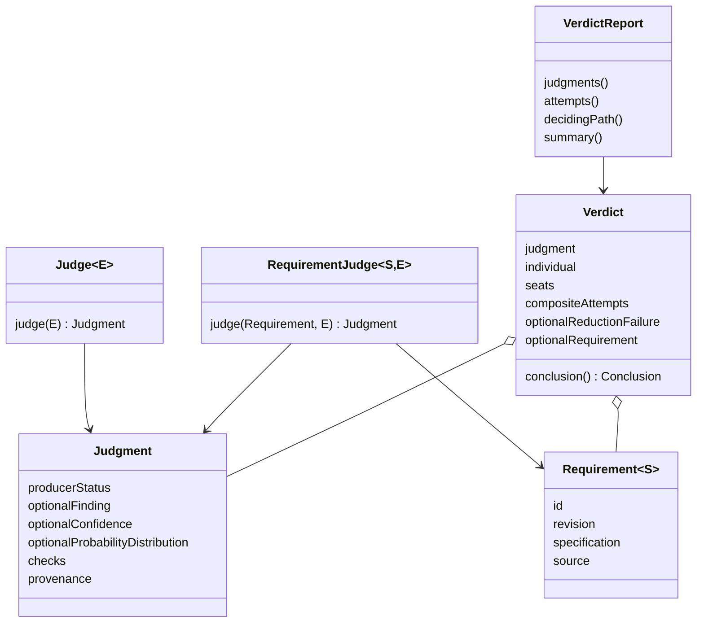
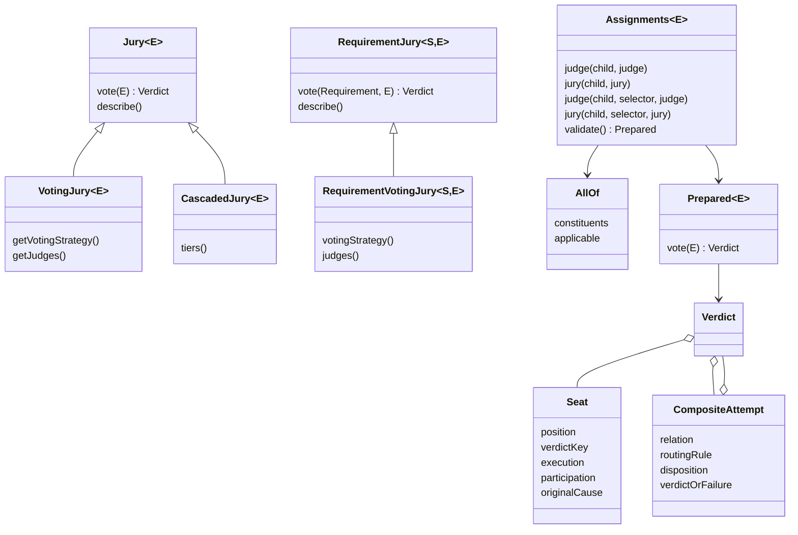
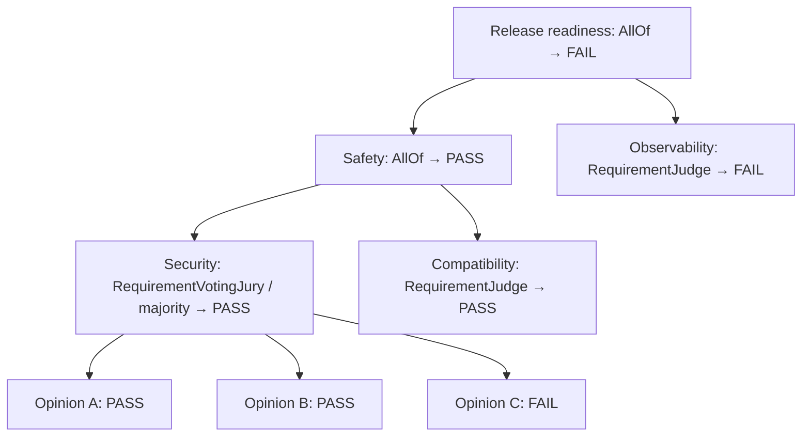
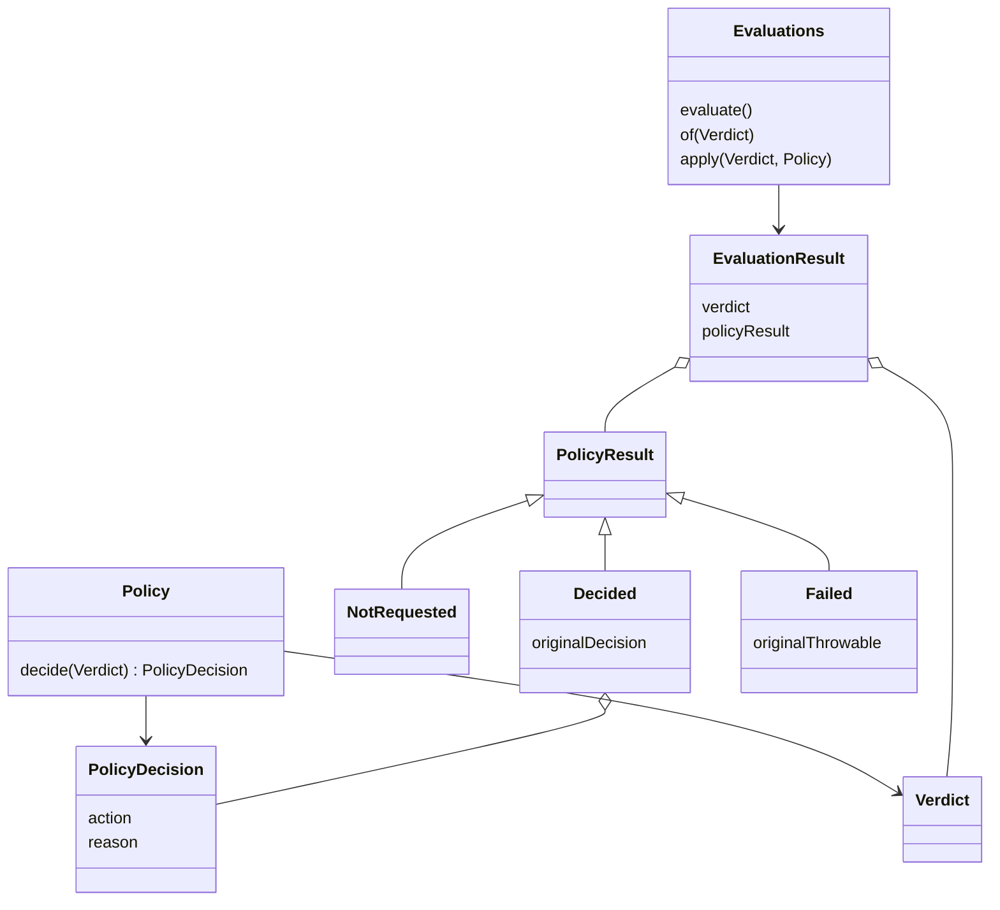
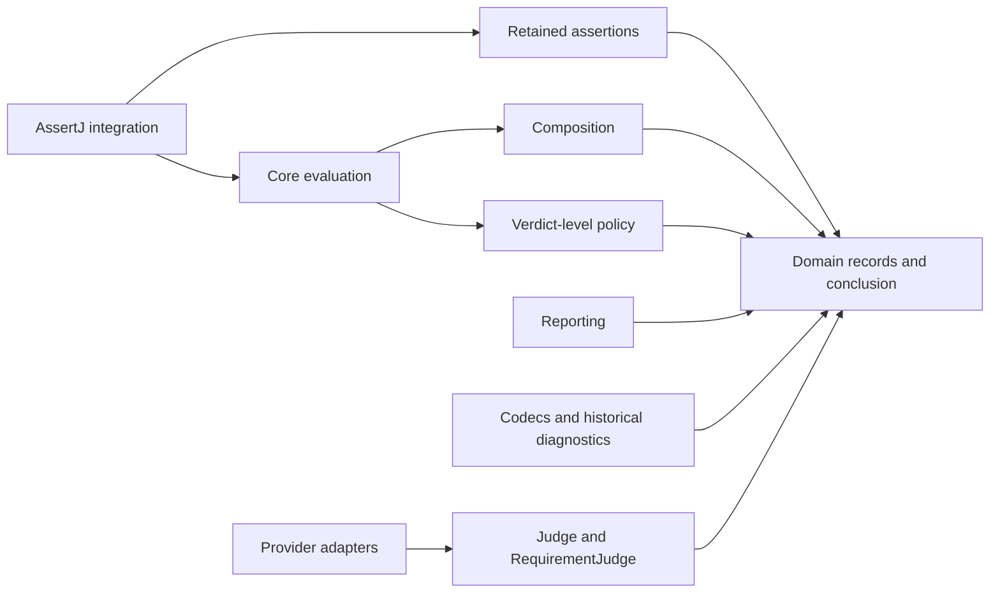

# Domain, composition, policy, and execution

The actual Requirement is supplied once per invocation. An ordinary Judge has an evidence-only input; a RequirementJudge receives the specification and evidence as sibling arguments. A Jury returns its complete Verdict, preserving each opinion and each entered child attempt.

The four conclusions are PASS, FAIL, INCONCLUSIVE and NOT_APPLICABLE. They are derived, never stored as a second writable decision. ERROR remains a producer or composition fact; an ERROR collective may coexist with an established individual rejection. Invalid records do not become INCONCLUSIVE.

Voting combines opinions about the same subject. All-of composition checks the parent's constituent requirements without flattening opinions from unrelated children. The parent owns the roster and logic; the immutable prepared assignment owns execution configuration. The compiler checks native specification and evidence types, including selector output types. Runtime validation checks complete coverage and unique structural references before invocation.

A required child with NOT_APPLICABLE leaves an all-of parent INCONCLUSIVE unless a sibling has already established FAIL. `AllOf(..., false)` is a separate declaration that the parent itself is inapplicable, so its validated plan executes no children. Ordinary evidence-only Verdicts carry no fabricated Requirement.

This concrete nested release check retains the security Jury's disagreement under its own constituent. The release fails because observability fails; positive opinions elsewhere cannot outvote that required constituent.

RELY means reliance on the retained conclusion, including rejection. ABSTAIN and ESCALATE withhold reliance. Policy never mutates Judgment or Verdict, and never restarts Jury routing. There is no requested-but-skipped policy state. Thrown policy exceptions and null decisions become Failed; cancellation and fatal Errors escape. Invalid configuration or unusable stored records produce no completed EvaluationResult.

## Package ownership

| Package / artifact | Responsibility and allowed direction |
|---|---|
| root `Judge`, `RequirementJudge`; `requirement`, `judgment`, `provenance` in core | Typed inputs, producer facts and source associations |
| `jury` in core | Voting, routing, seat participation, complete composite records, all-of assignments and shared conclusion semantics |
| `policy` in core | Complete-Verdict Policy and decision vocabulary |
| `evaluation` in core | Once-per-call orchestration and retained policy execution facts |
| `reporting` in core | Read-only traversal and prose over retained domain facts |
| `serialization` in core | Current format adapters, native specification registry and strict codec |
| `serialization.diagnostics` in core | Historical readers, unsupported-record diagnostics and explicit missing historical facts |
| `agent-judge-assertions` | OpenTest4J satisfaction assertions over EvaluationResult |
| `agent-judge-assertj` | Typed fluent stages and retained-result assertions |
| provider artifacts | Their transport, response protocols and measurement meaning |

Core has no AssertJ, OpenTest4J, JUnit, provider, or framework runtime dependency. Domain meaning is derived directly from typed retained facts; Jackson annotations select storage adapters but serialization is never invoked to determine a conclusion. The current codec and live path use the same `Verdict.conclusion()` validation rules. Historical diagnostic outcomes describe old stored evidence and cannot be supplied as domain conclusions.

Begin with [executable examples](agent-judge-assertj/src/test/java/io/github/markpollack/judge/assertj/AssertJApiExperienceTest.java), then [Requirement](agent-judge-core/src/main/java/io/github/markpollack/judge/requirement/Requirement.java), [Verdict](agent-judge-core/src/main/java/io/github/markpollack/judge/jury/Verdict.java), [Assignments](agent-judge-core/src/main/java/io/github/markpollack/judge/jury/Assignments.java), [Evaluations](agent-judge-core/src/main/java/io/github/markpollack/judge/evaluation/Evaluations.java), and the [wire contract](portable-results-v4.md).
