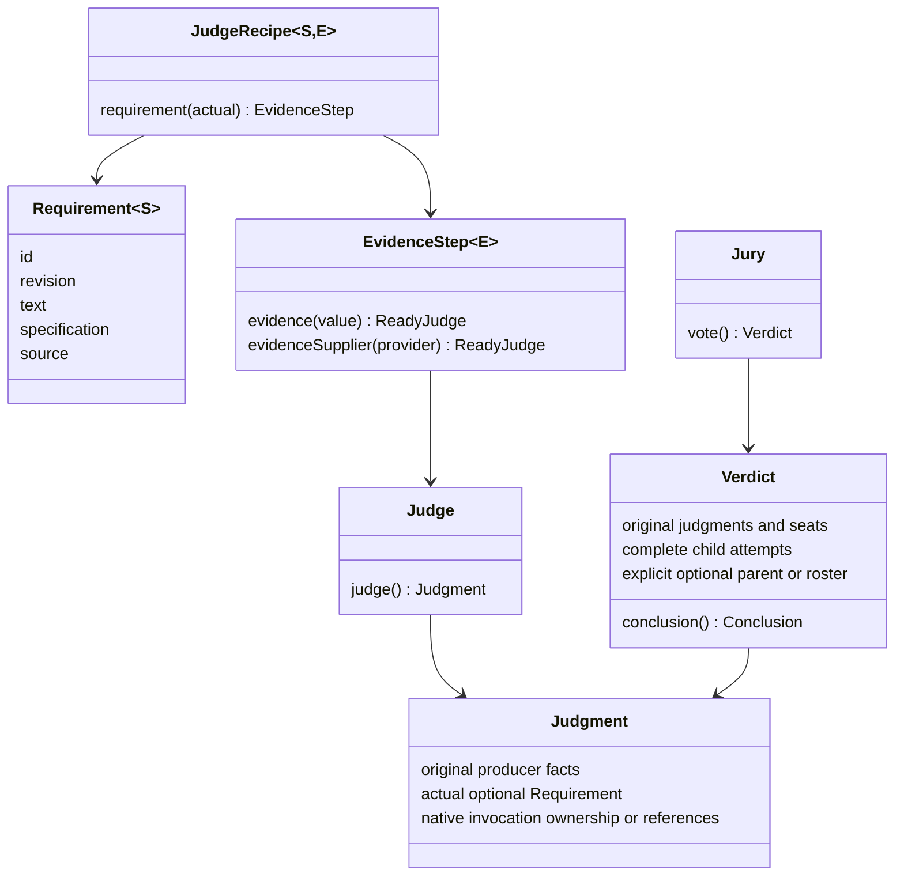
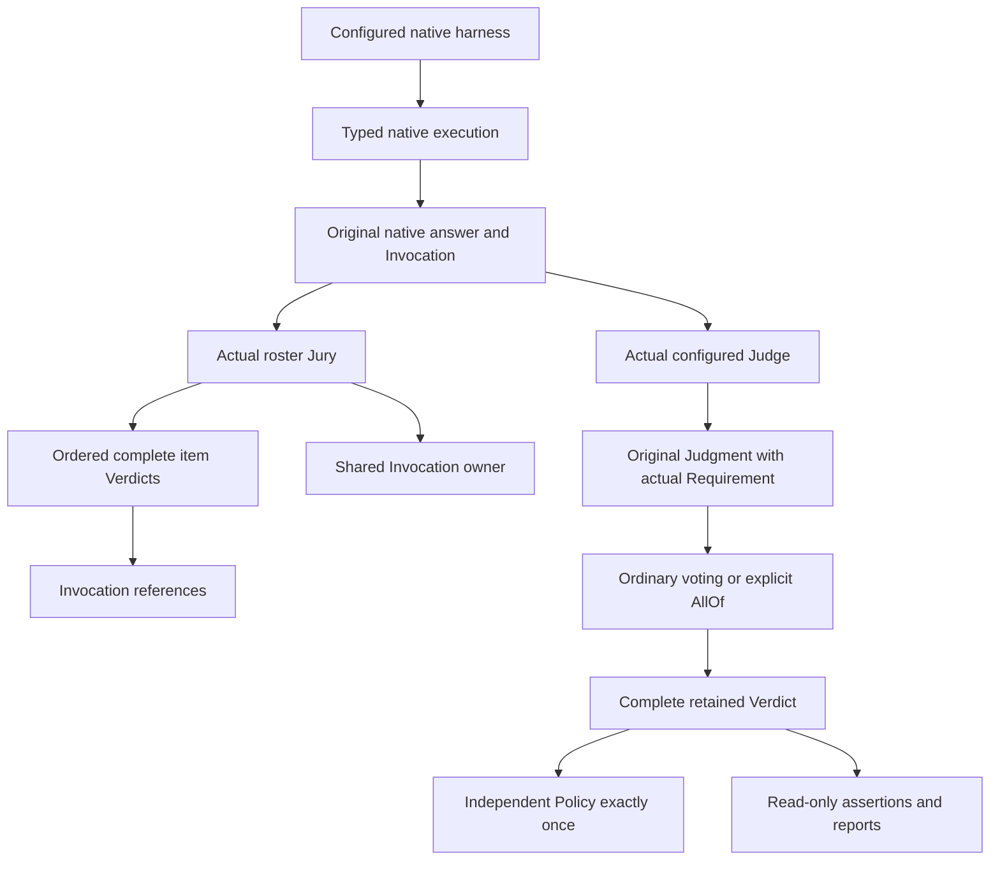
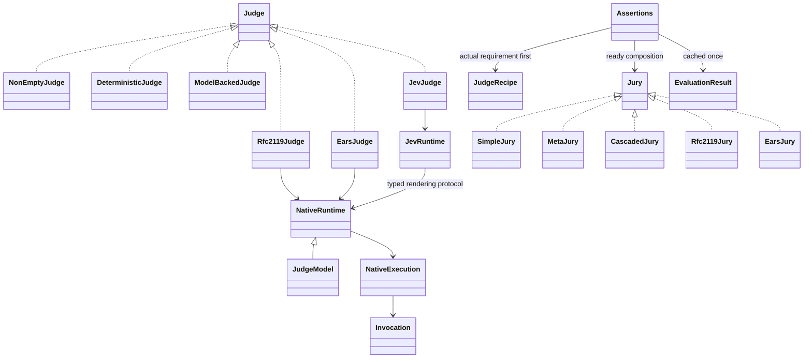

# Configured domain and execution boundaries

One non-generic Judge/Jury contract executes already configured inputs. Generic recipes describe construction only. Requirements are pure immutable values; native specifications own no duplicate outer identity.

A mixed ordinary Jury retains independent actual requirements/evidence and no asserted parent. AllOf declares a pure parent and complete constituent roster, with separately configured evaluators. RFC2119/EARS audits declare distinct required items without root opinion seats.

Generated investigative rosters call the native harness once. Per-item structured execution is explicitly separate, acquiring one complete evidence snapshot and invoking once per item. Native observations survive answer-decoding failure. Usage is counted once per invocation identity, including wrapper copies/references. Original exceptions remain in memory; portable observations never serialize Throwable graphs.

Seat-local undeclared exclusion preserves the original NOT_APPLICABLE answer and a separate ERROR treatment. A whole-tier refusal preserves the complete child but supplies no routing evidence. Valid accepted UNDECIDED inputs can still supply genuine FAIL opinions; accepted input is distinct from selected tier and participation in reduction.

One-declared-member Meta identity projects the complete child's conclusion and routing opinions. Multi-member Meta reduces member aggregates. Cascades route with one shared derived predicate, preserving original selected child facts. AllOf/roster audits declare KNOWN_NONE opinions; opaque custom descriptions declare UNKNOWN. Applicability permission derives from the structured description.

Conclusions are PASS, FAIL, INCONCLUSIVE and NOT_APPLICABLE. Policy consumes the whole usable Verdict without rewriting it. Retained assertions/reports execute no producers or policies. Live assertion stages cache results or thrown failures. No universal context map carries typed construction inputs.

Depth 8 and executed composite-attempt 32 bounds remain. The independent native roster bound is 256 items. Storage of the new retained shapes is an explicit version boundary; frozen historical artifacts retain their original semantics.

The public implementations share those two execution operations:

`construction` owns recipes and evidence stages; `execution` owns typed protocol requests/answers; `provenance` owns native facts/artifact references. `jury` owns seats, routing, complete attempts and invocation ownership validation. `ai.requirements` owns pure native specifications, their actual Judges/Juries and explicit reconstruction. `evaluation`, `policy`, `reporting`, `serialization` and `assertj` keep execution, reliance and retained reading distinct.

Construction snapshots configuration and collection membership. Arbitrary application evidence must itself be immutable or safely owned; the library cannot deep-copy an unknown Java type. Each direct operation is fresh, and a dynamic provider resolves once at its declared acquisition boundary. Native clients, providers and artifact retainers remain caller-owned and must support the caller's concurrency. A fluent assertion stage synchronizes its one completion; separate pre-execution branches represent separate evaluations.
